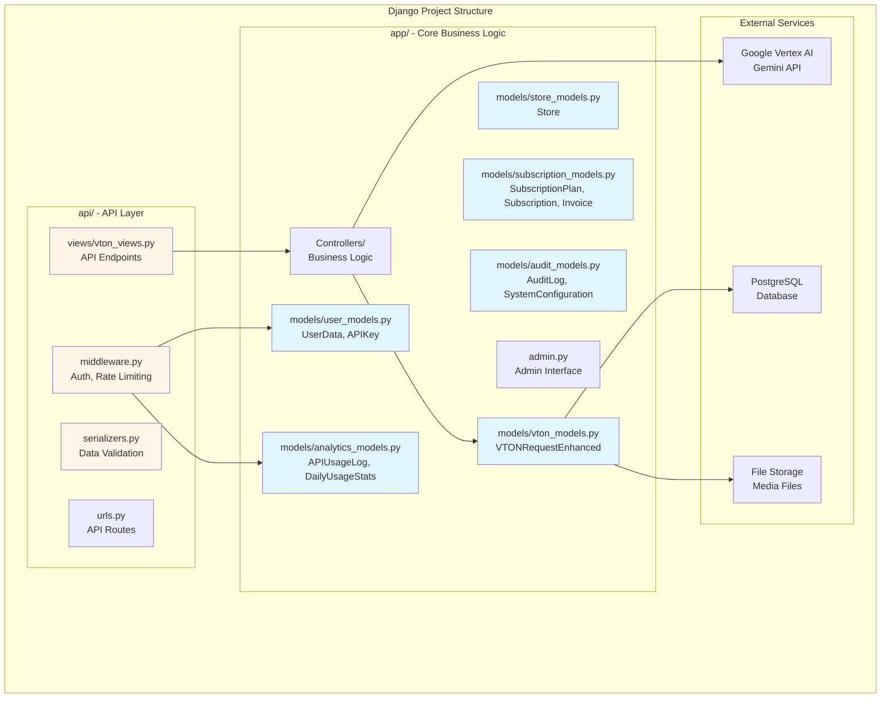
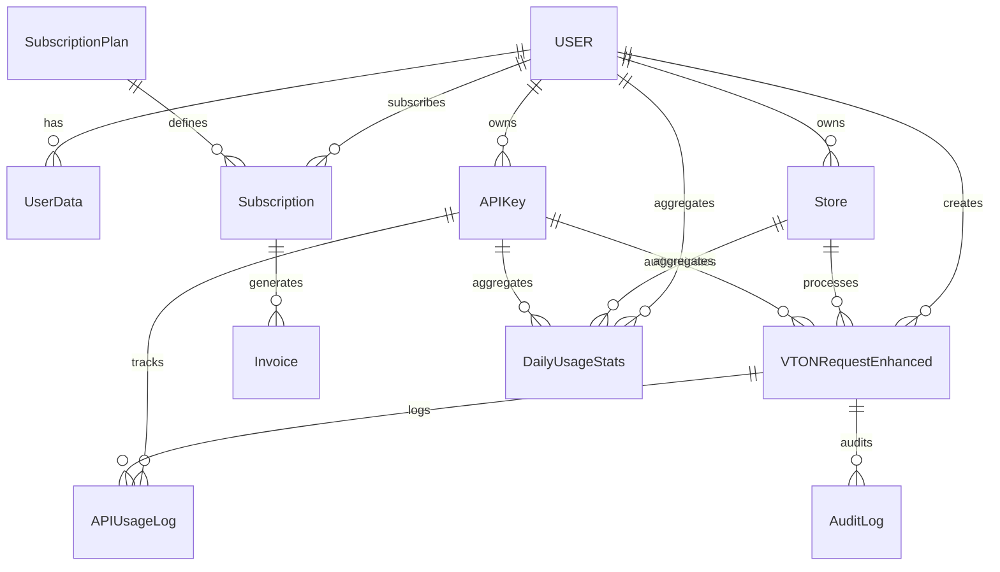
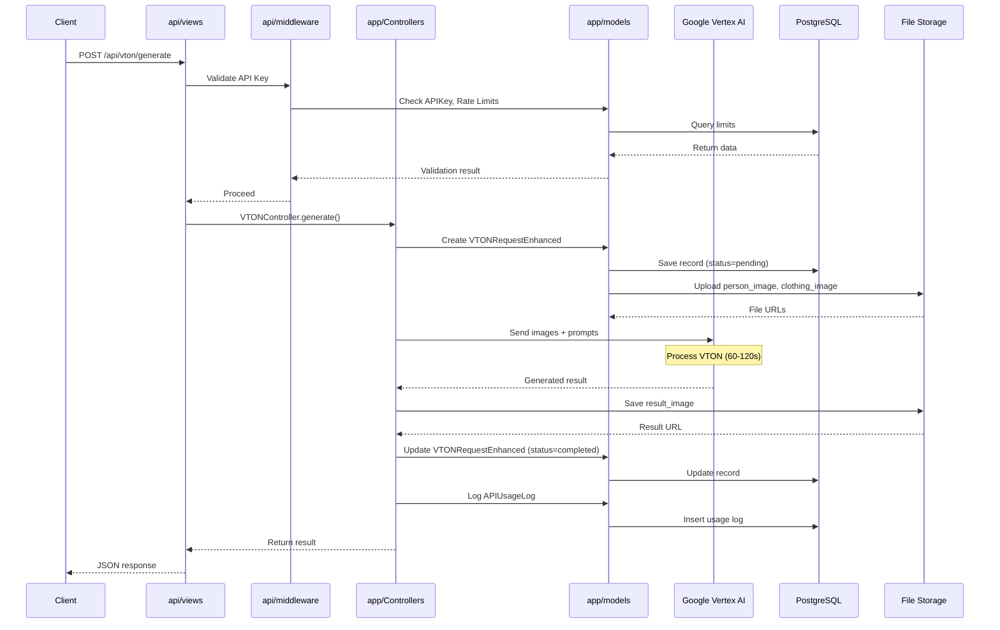
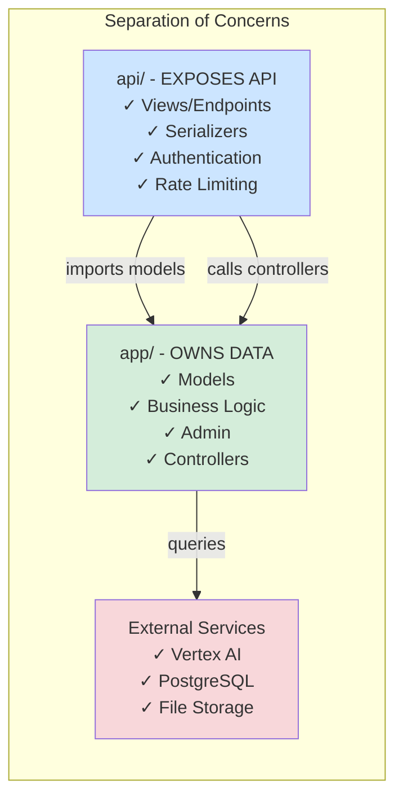
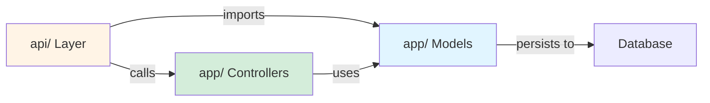
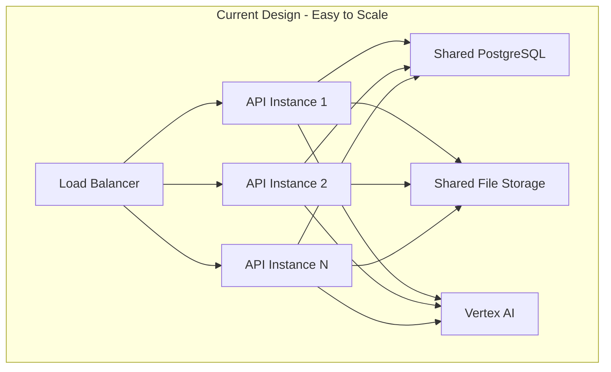

Searched codebase for "I you would suggest me a best system design in my scenario, what woudl that be?

you can generate that using mermaid for showing me visually", 16 results

Based on your VTON Django project, here's my recommended **best system design** with visual diagrams:

## 🎯 Recommended Architecture

### **Hybrid Approach: Core Models in `app`, API-Specific Logic in `api`**



## 🏗️ Detailed System Design

### **1. Data Layer Architecture**



### **2. Request Flow Architecture**



### **3. Component Responsibility Matrix**



## 📋 Recommended File Structure

```plaintext
VTON_APP/
├── app/                          # ✅ CORE: Business Logic & Data
│   ├── models/
│   │   ├── __init__.py          # Import all models
│   │   ├── user_models.py       # UserData, APIKey
│   │   ├── store_models.py      # Store
│   │   ├── vton_models.py       # VTONRequestEnhanced
│   │   ├── subscription_models.py # Plans, Subscriptions, Invoices
│   │   ├── analytics_models.py  # APIUsageLog, DailyUsageStats
│   │   └── audit_models.py      # AuditLog, SystemConfiguration
│   ├── Controllers/
│   │   ├── VTONController.py    # VTON business logic
│   │   ├── HelpersController.py # File handling, utilities
│   │   └── SubscriptionController.py # Billing logic
│   ├── admin.py                 # Django admin configuration
│   └── migrations/              # Database migrations
│
├── api/                          # ✅ API LAYER: External Interface
│   ├── views/
│   │   ├── vton_views.py        # VTON API endpoints
│   │   ├── auth_views.py        # Authentication endpoints
│   │   └── store_views.py       # Store management endpoints
│   ├── serializers.py           # DRF serializers
│   ├── middleware.py            # Rate limiting, logging
│   ├── urls.py                  # API routing
│   └── utils/
│       └── validators.py        # Input validation
│
├── VTON_APP/                     # ✅ PROJECT CONFIG
│   ├── settings.py
│   ├── urls.py
│   └── wsgi.py
│
└── manage.py
```

## 🎯 Key Design Principles Applied

### **1. Single Responsibility**

- **`app/`**: Manages data models, business logic, database operations
- **`api/`**: Handles HTTP requests, authentication, serialization
- **Controllers**: Orchestrate complex operations (VTON processing)

### **2. Dependency Direction**



### **3. Scalability Considerations**



## 🔥 Why This Design is Best for Your Use Case

| Aspect                  | Benefit                                                              |
| ----------------------- | -------------------------------------------------------------------- |
| **🎯 Clear Separation** | `app` owns data, `api` exposes it—easy to maintain                   |
| **📈 Scalable**         | Add more API workers without model duplication                       |
| **🔐 Secure**           | Rate limiting and auth in `api` layer, data validation in models     |
| **🧪 Testable**         | Test business logic independently of API layer                       |
| **📦 Reusable**         | Models can be used by future admin panels, mobile apps, or CLI tools |
| **⚡ Performance**      | Database indexes optimized in models, caching in API views           |
| **🛠️ Maintainable**     | Each file has <200 lines, focused responsibility                     |

## 🚀 Migration Path (If Needed)

If you have any models in models.py, consolidate them into `app/models/`:

```python
# ❌ OLD (if models were in api/):
# from api.models import VTONRequest

# ✅ NEW (models in app/):
from app.models import VTONRequestEnhanced
from app.Controllers.VTONController import VTONController

class VTONGenerateView(APIView):
    def post(self, request):
        # API logic calls controller
        controller = VTONController()
        result = controller.generate_virtual_tryon(...)
        return Response({"result": result})
```

This design gives you **maximum flexibility, maintainability, and scalability** for your VTON SaaS platform! 🎉
